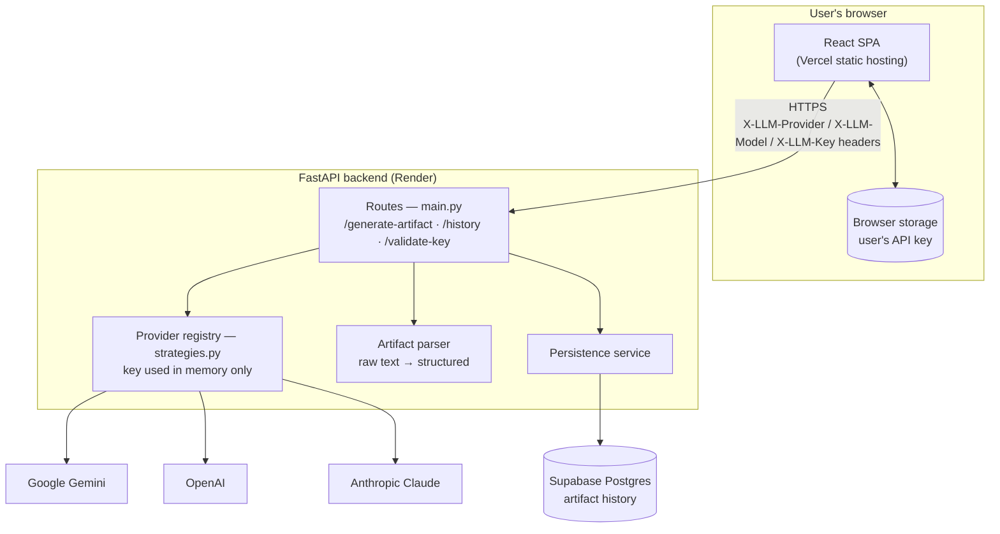
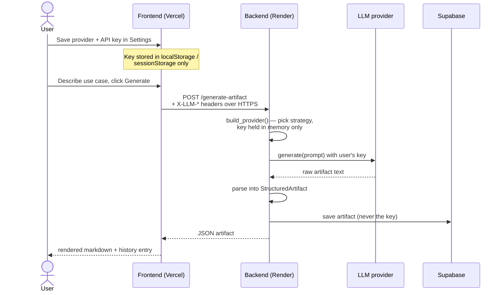
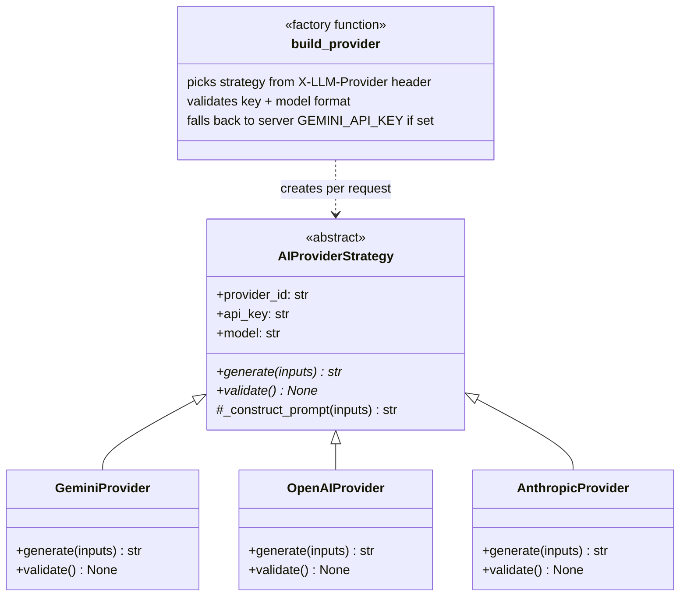
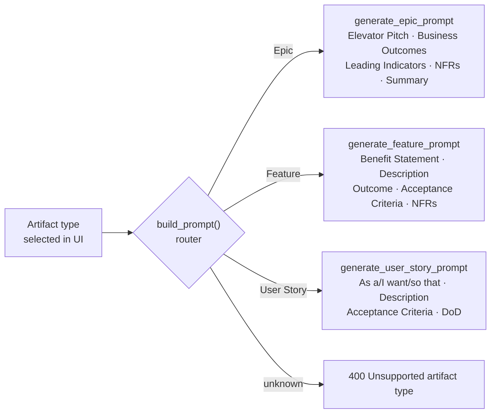

# AI Artifact Generator

Turn a plain-language business requirement into a ready-to-use Agile artifact — User Story, Epic, Feature, or Bug — using the LLM of your choice. Users bring their own API key (Gemini, OpenAI, or Anthropic) via the in-app Settings; keys are stored only in the browser and never persisted server-side.

**Live app:** https://ai-artifact-generator.vercel.app

**Stack:** React + Vite + Tailwind (frontend, Vercel) · FastAPI (backend, Render) · Postgres (Supabase)

## Architecture

### System overview



### Bring-your-own-key (BYOK) request flow



### Provider layer (UML)

The backend uses a strategy pattern: one abstract interface, one concrete class per LLM vendor, and a per-request factory that never persists the user's key.



### Artifact-specific prompts

Each artifact type has its own dedicated prompt template in [prompts.py](prompts.py) — there is no single generic prompt with the type substituted in, because Epic, Feature and User Story sit at different levels of abstraction.



Every template carries explicit anti-contamination rules (an Epic must not contain Features or User Stories, and so on) and a shared set of quality rules. The response parser in `main.py` is section-driven and kept in sync with these templates.

Run the prompt/parser tests with:

```bash
python test_artifact_prompts.py
```

### Security model

- The user's API key lives only in their browser (`localStorage`, or `sessionStorage` when "remember" is off) and travels only as an HTTPS request header — never in a URL, never in the database, never in logs.
- The backend instantiates a provider with the key for a single request, then discards it. Logging runs at INFO level so headers can't leak through debug output.
- Provider errors are translated: invalid key → 401 with a friendly message, rate limit → 429. Raw provider exception text is never echoed to the client.
- Adding a new LLM vendor = one new subclass of `AIProviderStrategy` plus a registry entry.

## Run locally

Prerequisites: Node.js, Python 3.13

**Backend**
```bash
pip install -r requirements.txt
# set DATABASE_URL (Supabase connection string) in a .env file
uvicorn main:app --reload --port 8000
```

**Frontend**
```bash
npm install
echo VITE_API_BASE_URL=http://localhost:8000 > .env.local
npm run dev
```

## Deploy the backend to Render (free)

The repo contains a [render.yaml](render.yaml) blueprint, so Render configures itself:

1. Sign up at [render.com](https://render.com) with your GitHub account (free, no card needed).
2. Click **New + → Blueprint** and select the `AI-Artifact-Generator` repo.
3. Render reads `render.yaml` and prompts for one value: `DATABASE_URL`.
   Paste your Supabase connection string — in Supabase go to **Connect → Transaction pooler** and copy the URI (port `6543`; replace `[YOUR-PASSWORD]` with your real database password).
4. Click **Apply**. First build takes a few minutes; when it turns "Live", copy the service URL.
5. Point the frontend at it: in Vercel go to **Settings → Environment Variables**, add `VITE_API_BASE_URL` = the Render URL, then **Deployments → Redeploy**.

Optional but recommended on the free plan: create a free [UptimeRobot](https://uptimerobot.com) HTTP monitor pinging the Render URL every 5 minutes. This keeps the instance warm — otherwise it spins down after 15 idle minutes and the next user waits ~40 s.

Optional: add a `GEMINI_API_KEY` environment variable on the Render service to enable keyless demo mode; without it, users must add their own key in Settings (gear icon).

## Environment variables

| Where | Variable | Purpose |
|---|---|---|
| Backend (Render) | `DATABASE_URL` | Supabase Postgres connection string (required) |
| Backend (Render) | `GEMINI_API_KEY` | Optional server fallback key for keyless demo mode |
| Frontend (Vercel) | `VITE_API_BASE_URL` | Backend base URL, no trailing slash |
